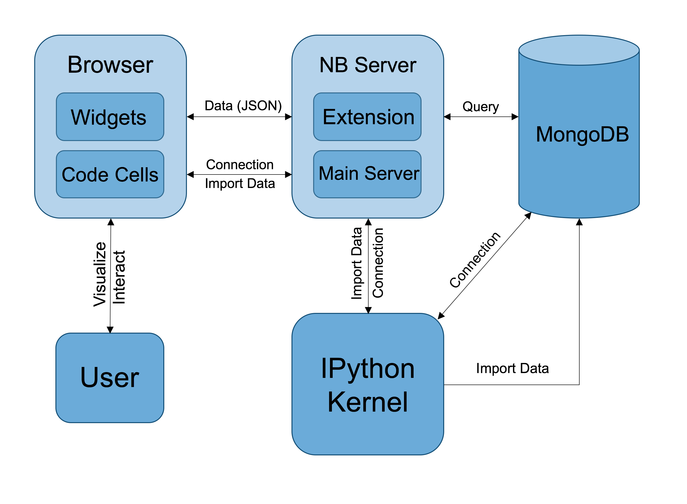
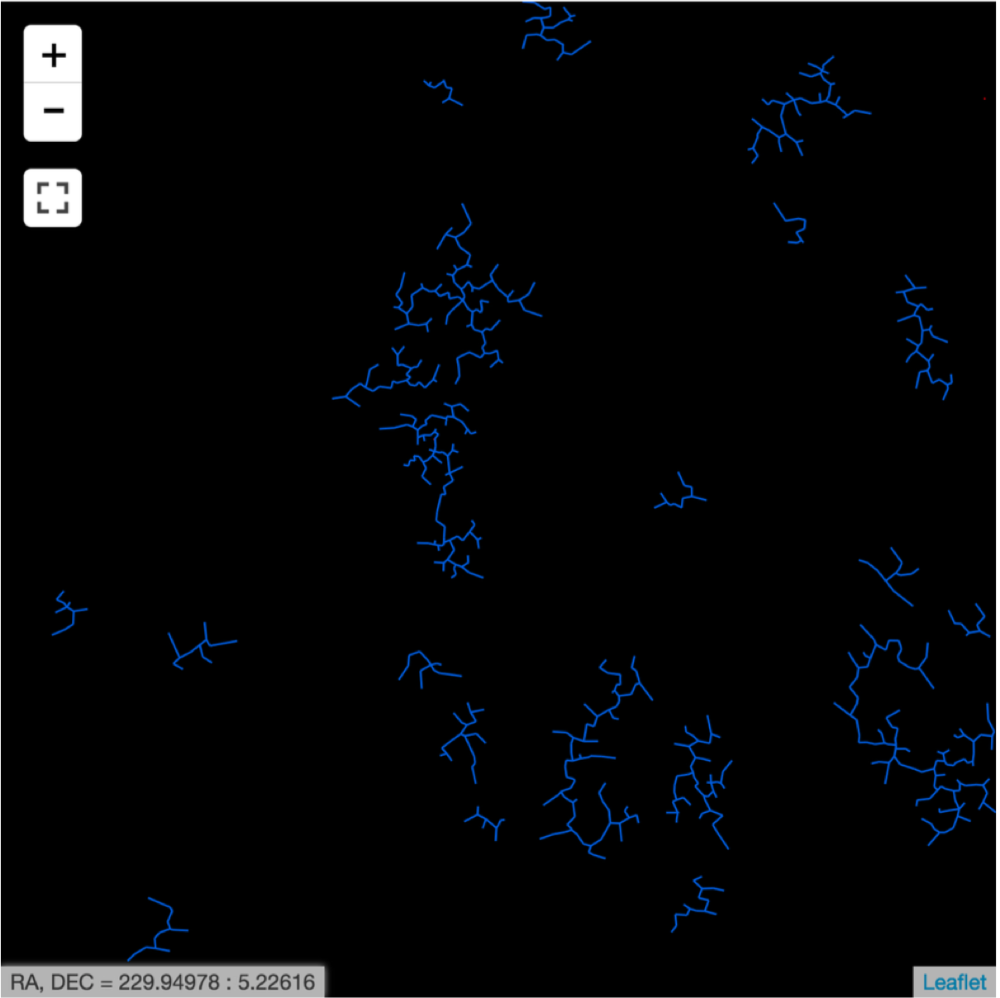

********
Overview
********

==============
What is Vizic?
==============

**Vizic** is a visualization tool, which is initially designed to explore and interact with astronomical catalogs from large sky surveys. **Vizic** is written in both Python and JavaScript and works inside the Jupyter_ Notebook App. **Vizic** can be adopted in variety of exercises, for example, data inspection, clustering analysis, galaxy alignment studies, outlier identification or just large-scale visualizations for large datasets. At this stage, Astronomy is only one application for **Vizic**. All scientific research that requires visualization of large geospatial data could find it useful.

	.. _Jupyter: http://jupyter.org/

===============
Software Design
===============

The core functionality of **Vizic**, the visualization and browsing of catalogs, is implemented using Leaflet_. **Leaflet** is a major JavaScript library for building map applications on the web. To embed Leaflet maps into the Jupyter Notebook App, **Vizic** uses ipyleaflet_, a Jupyter wrapper for **Leaflet**, which is developed using ipywidgets_. In addition, MongoDB database is used for storing and distributing catalog data to front-end Leaflet maps. The adoption of a MongoDB database makes it possible to efficiently sort and filter the catalogs and to dynamically create vector tiles using **Leaflet**, which was not possible in the past.

	.. _Leaflet: http://leafletjs.com/
	.. _ipyleaflet: https://github.com/ellisonbg/ipyleaflet
	.. _ipywidgets: http://ipywidgets.readthedocs.io/en/stable/index.html

The following diagram demonstrates how different components of **Vizic** works with each other:

================
Rich Interaction
================

**Vizic** also provides added Jupyter widgets to control and customize the display of visualized catalogs, for an example, to filter out objects in a given catalog that lie outside a particular range of certain property. We can also color map all displayed objects based on one of the property ranges of the corresponding catalog.

===============
Custom Overlays
===============

The most unique feature of **Vizic** is its capability to interactively display the hidden pattern revealed by the geospatial distribution of the astronomical objects in a given catalog. **Vizic** offers several graphical tools to achieve this goal, namely `Voronoi`_ overlay, `Delaunay`_ overlay, `Minimum Spanning Tree`_ (MST) overlay and HEALPix_ Grid overlay. For any given visualized catalog, custom overlays can be generated and appended on top of the catalog layer by executing one simple line of Python code. These overlays can also zoom in/out and shift to accommodate the movement of the catalog layer. Such a unique feature makes **Vizic** particularly useful for studying cosmic structures.

Here is a figure showing four different custom overlays:

.. image:: imgs/custom.png

Last but not the least, the Minimum Spanning Tree overlay offers added capability to trim the tree by both maximum edge length and minimum branch size (the number of edges in any branch after the cut).

	.. _Voronoi: https://en.wikipedia.org/wiki/Voronoi_diagram
	.. _Delaunay: https://en.wikipedia.org/wiki/Delaunay_triangulation
	.. _Minimum Spanning Tree: https://en.wikipedia.org/wiki/Minimum_spanning_tree
	.. _HEALPix: http://healpix.sourceforge.net/

A comparison to the subfigure **(b)** shown above, where the MST has been trimmed:

